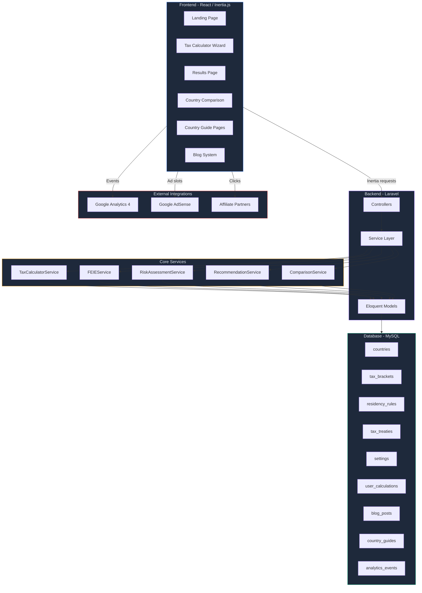
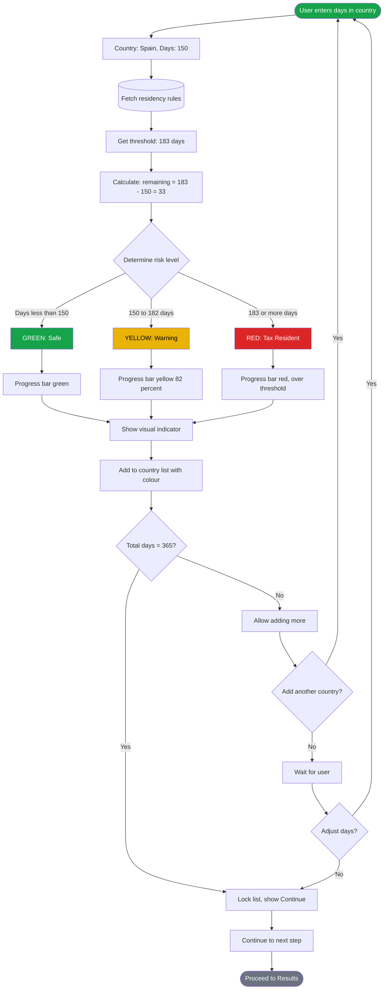
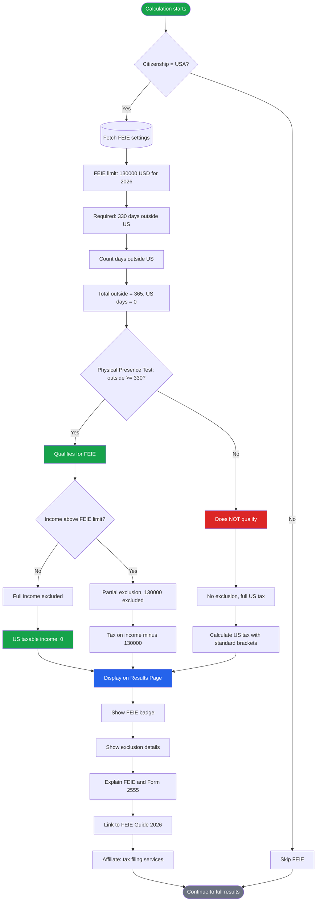
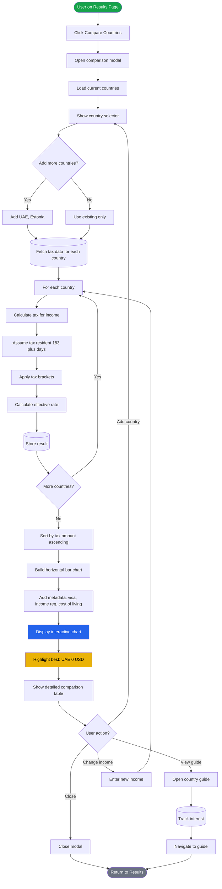
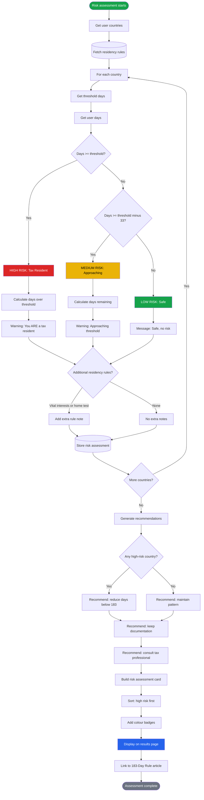
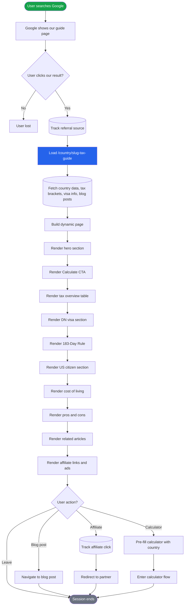
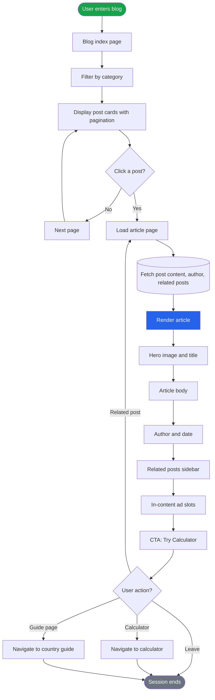
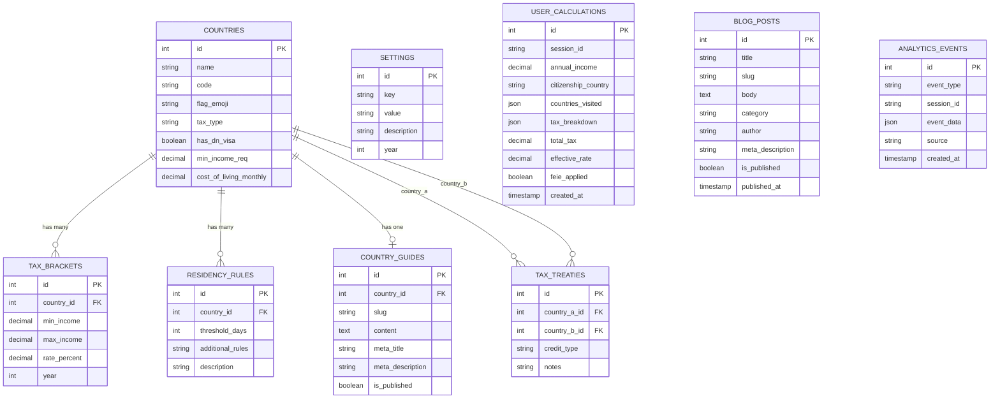
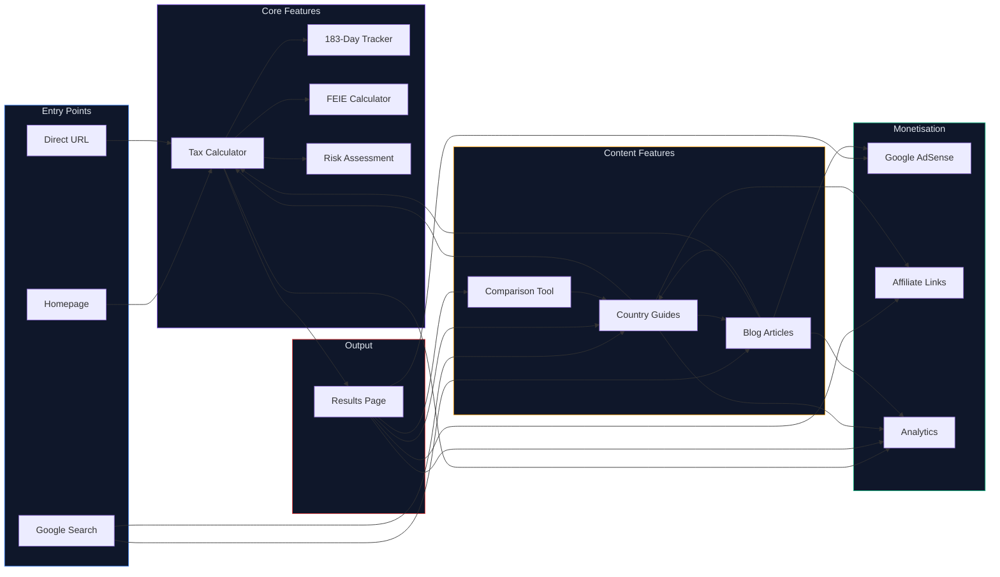

# NomadTax MVP — Architecture & Flow Diagrams

> Every diagram below is **valid Mermaid** syntax.
> Paste any block into [mermaid.live](https://mermaid.live) to verify.

---

## 1. High-Level System Architecture

---

## 2. Multi-Country Tax Calculator — Full User Flow

```mermaid
flowchart TD
    START(["User visits homepage"]) --> LAND["Landing Page"]
    LAND --> CTA{"Clicks Try Calculator"}
    CTA --> S1["Step 1: Income and Citizenship"]

    S1 --> INPUT1["Enter annual income and citizenship"]
    INPUT1 --> V1{"Valid input?"}
    V1 -->|"No"| ERR1["Show error message"]
    ERR1 --> INPUT1
    V1 -->|"Yes"| SAVE1[("Save to session")]
    SAVE1 --> S2["Step 2: Countries Visited"]

    S2 --> ADD["Add country and days"]
    ADD --> LIST["Display country list"]
    LIST --> DAYCHECK{"Total days = 365?"}
    DAYCHECK -->|"No"| ADDMORE["Add more countries"]
    ADDMORE --> ADD
    DAYCHECK -->|"Yes"| RULE183{"Any country >= 183 days?"}
    RULE183 -->|"Yes"| WARN["Show tax-resident warning"]
    RULE183 -->|"No"| SAFE["Show all safe"]
    WARN --> SAVE2[("Save countries to session")]
    SAFE --> SAVE2
    SAVE2 --> S3["Step 3: Review and Calculate"]

    S3 --> SUMMARY["Display summary"]
    SUMMARY --> CALCBTN{"Click Calculate"}
    CALCBTN --> BACKEND["Backend Processing"]

    BACKEND --> FETCHDB[("Fetch tax brackets, residency rules, treaties, FEIE settings")]
    FETCHDB --> LOOP_COUNTRY["For each country"]
    LOOP_COUNTRY --> IS_RESIDENT{"Tax resident?"}
    IS_RESIDENT -->|"Yes"| CALC_TAX["Calculate progressive tax"]
    IS_RESIDENT -->|"No"| NEXT_C["Next country"]
    CALC_TAX --> HAS_TREATY{"Treaty exists?"}
    HAS_TREATY -->|"Yes"| APPLY_CREDIT["Apply foreign tax credit"]
    HAS_TREATY -->|"No"| RAW_TAX["Use raw tax amount"]
    APPLY_CREDIT --> NEXT_C
    RAW_TAX --> NEXT_C
    NEXT_C --> MORE_C{"More countries?"}
    MORE_C -->|"Yes"| LOOP_COUNTRY
    MORE_C -->|"No"| US_CHECK{"US citizen?"}

    US_CHECK -->|"Yes"| FEIE_CALC["Calculate FEIE exclusion"]
    US_CHECK -->|"No"| SKIP_FEIE["Skip FEIE"]
    FEIE_CALC --> FEIE_QUALIFY{"Qualifies for FEIE?"}
    FEIE_QUALIFY -->|"Yes"| APPLY_FEIE["Reduce US tax liability"]
    FEIE_QUALIFY -->|"No"| NO_FEIE["No FEIE applied"]
    APPLY_FEIE --> TOTAL["Calculate total tax"]
    NO_FEIE --> TOTAL
    SKIP_FEIE --> TOTAL

    TOTAL --> GEN_REC["Generate recommendations"]
    GEN_REC --> SAVE_CALC[("Save to user_calculations")]
    SAVE_CALC --> TRACK[("Track analytics event")]
    TRACK --> RESULTS["Display Results Page"]

    RESULTS --> BREAKDOWN["Tax breakdown per country"]
    BREAKDOWN --> CHART["Comparison chart"]
    CHART --> WARNINGS["Residency warnings"]
    WARNINGS --> RECS["Recommendations"]
    RECS --> AFFILIATES["Affiliate links"]
    AFFILIATES --> ADSLOT["Google Ads"]

    ADSLOT --> ACTION{"User action?"}
    ACTION -->|"Adjust inputs"| S1
    ACTION -->|"View guide"| GUIDEPAGE["Country Tax Guide"]
    ACTION -->|"Click affiliate"| TRACK_AFF[("Track affiliate click")]
    ACTION -->|"Share"| SHARE["Generate shareable URL"]
    ACTION -->|"Done"| FINISH(["Session ends"])
    TRACK_AFF --> EXTSITE["Redirect to partner"]
    EXTSITE --> FINISH
    GUIDEPAGE --> FINISH
    SHARE --> FINISH

    style START fill:#16a34a,color:#fff
    style FINISH fill:#dc2626,color:#fff
    style BACKEND fill:#2563eb,color:#fff
    style RESULTS fill:#ea580c,color:#fff
```

---

## 3. 183-Day Rule Tracker — Flow

---

## 4. FEIE Calculator — Flow

---

## 5. Country Comparison Tool — Flow

---

## 6. Tax Residency Risk Assessment — Flow

---

## 7. Country Tax Guide Page — SEO Flow

---

## 8. Blog System — Content Flow

---

## 9. Complete MVP Data Model — ER Diagram

---

## 10. Overall MVP Feature Interaction Map

