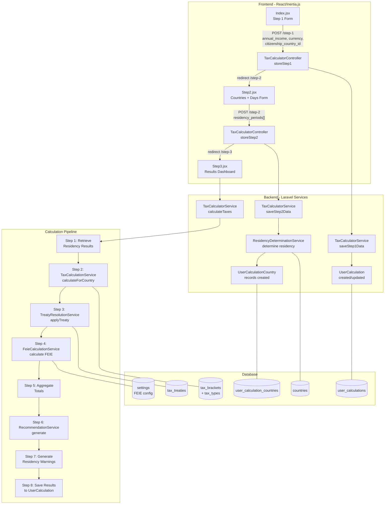
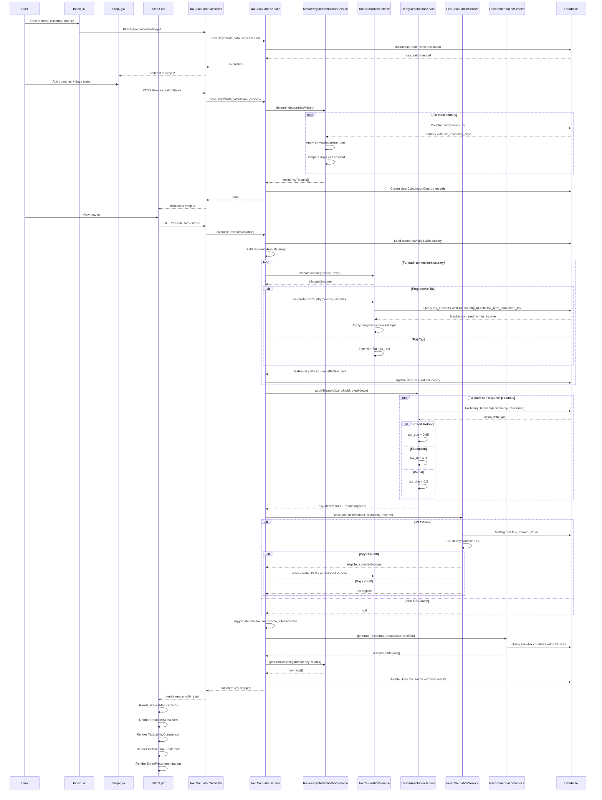
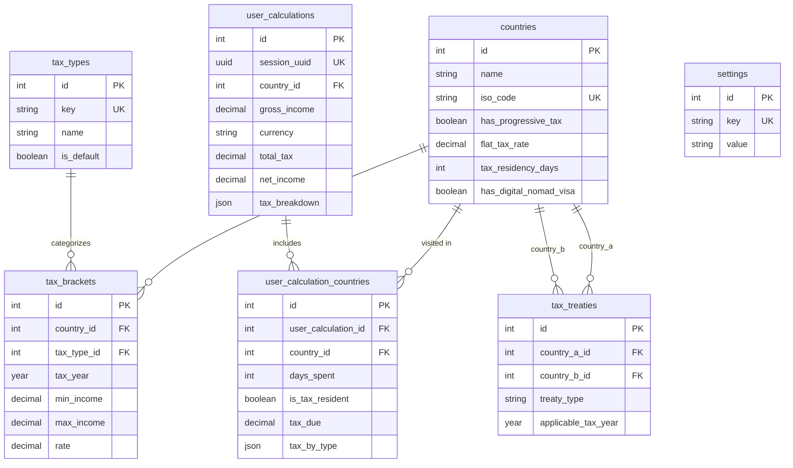

# Tax Calculator — End-to-End Flow

## System Architecture

```mermaid
graph TB
    subgraph "Frontend - React/Inertia.js"
        A["Index.jsx<br/>Step 1 Form"] -->|"POST /step-1<br/>annual_income, currency,<br/>citizenship_country_id"| B["TaxCalculatorController<br/>storeStep1"]
        B -->|"redirect /step-2"| C["Step2.jsx<br/>Countries + Days Form"]
        C -->|"POST /step-2<br/>residency_periods[]"| D["TaxCalculatorController<br/>storeStep2"]
        D -->|"redirect /step-3"| E["Step3.jsx<br/>Results Dashboard"]
    end

    subgraph "Backend - Laravel Services"
        B --> F["TaxCalculatorService<br/>saveStep1Data"]
        F --> G["UserCalculation<br/>created/updated"]

        D --> H["TaxCalculatorService<br/>saveStep2Data"]
        H --> I["ResidencyDeterminationService<br/>determine residency"]
        I --> J["UserCalculationCountry<br/>records created"]

        E --> K["TaxCalculatorService<br/>calculateTaxes"]
    end

    subgraph "Calculation Pipeline"
        K --> L["Step 1: Retrieve<br/>Residency Results"]
        L --> M["Step 2: TaxCalculationService<br/>calculateForCountry"]
        M --> N["Step 3: TreatyResolutionService<br/>applyTreaty"]
        N --> O["Step 4: FeieCalculationService<br/>calculate FEIE"]
        O --> P["Step 5: Aggregate<br/>Totals"]
        P --> Q["Step 6: RecommendationService<br/>generate"]
        Q --> R["Step 7: Generate<br/>Residency Warnings"]
        R --> S["Step 8: Save Results<br/>to UserCalculation"]
    end

    subgraph "Database"
        G --- T[("user_calculations")]
        J --- U[("user_calculation_countries")]
        M --- V[("tax_brackets<br/>+ tax_types")]
        N --- W[("tax_treaties")]
        I --- X[("countries")]
        O --- Y[("settings<br/>FEIE config")]
    end
```

## Detailed Calculation Flow

```mermaid
sequenceDiagram
    participant User
    participant Step1 as Index.jsx
    participant Step2 as Step2.jsx
    participant Step3 as Step3.jsx
    participant Controller as TaxCalculatorController
    participant Service as TaxCalculatorService
    participant Residency as ResidencyDeterminationService
    participant TaxCalc as TaxCalculationService
    participant Treaty as TreatyResolutionService
    participant FEIE as FeieCalculationService
    participant Recommend as RecommendationService
    participant DB as Database

    User->>Step1: Enter income, currency, country
    Step1->>Controller: POST /tax-calculator/step-1
    Controller->>Service: saveStep1Data(data, sessionUuid)
    Service->>DB: updateOrCreate UserCalculation
    DB-->>Service: calculation record
    Service-->>Controller: calculation
    Controller-->>Step2: redirect to /step-2

    User->>Step2: Add countries + days spent
    Step2->>Controller: POST /tax-calculator/step-2
    Controller->>Service: saveStep2Data(calculation, periods)
    Service->>Residency: determine(countriesVisited)

    loop For each country
        Residency->>DB: Country::find(country_id)
        DB-->>Residency: country with tax_residency_days
        Residency->>Residency: Apply arrival/departure rules
        Residency->>Residency: Compare days vs threshold
    end

    Residency-->>Service: residencyResults[]
    Service->>DB: Create UserCalculationCountry records
    Service-->>Controller: done
    Controller-->>Step3: redirect to /step-3

    User->>Step3: View results
    Step3->>Controller: GET /tax-calculator/step-3
    Controller->>Service: calculateTaxes(calculation)

    Service->>DB: Load countriesVisited with country
    Service->>Service: Build residencyResults array

    loop For each tax-resident country
        Service->>TaxCalc: allocateIncome(income, days)
        TaxCalc-->>Service: allocatedIncome

        alt Progressive Tax
            Service->>TaxCalc: calculateForCountry(country, income)
            TaxCalc->>DB: Query tax_brackets WHERE country_id AND tax_type_id=income_tax
            DB-->>TaxCalc: brackets ordered by min_income
            TaxCalc->>TaxCalc: Apply progressive bracket logic
        else Flat Tax
            TaxCalc->>TaxCalc: income × flat_tax_rate
        end

        TaxCalc-->>Service: taxResult with tax_due, effective_rate
        Service->>DB: Update UserCalculationCountry
    end

    Service->>Treaty: applyTreaty(citizenshipId, breakdown)

    loop For each non-citizenship country
        Treaty->>DB: TaxTreaty::between(citizenship, residence)
        DB-->>Treaty: treaty with type

        alt Credit Method
            Treaty->>Treaty: tax_due × 0.85
        else Exemption
            Treaty->>Treaty: tax_due = 0
        else Partial
            Treaty->>Treaty: tax_due × 0.5
        end
    end

    Treaty-->>Service: adjustedResults + treatiesApplied

    Service->>FEIE: calculate(citizenshipId, residency, income)

    alt US Citizen
        FEIE->>DB: Setting::get feie_amount_2026
        FEIE->>FEIE: Count days outside US
        alt Days >= 330
            FEIE-->>Service: eligible, excludedIncome
            Service->>TaxCalc: Recalculate US tax on reduced income
        else Days < 330
            FEIE-->>Service: not eligible
        end
    else Non-US Citizen
        FEIE-->>Service: null
    end

    Service->>Service: Aggregate totalTax, netIncome, effectiveRate

    Service->>Recommend: generate(residency, breakdown, totalTax)
    Recommend->>DB: Query zero-tax countries with DN visas
    Recommend-->>Service: recommendations[]

    Service->>Residency: generateWarnings(residencyResults)
    Residency-->>Service: warnings[]

    Service->>DB: Update UserCalculation with final results
    Service-->>Controller: complete result object
    Controller-->>Step3: Inertia render with result

    Step3->>Step3: Render ResultMetricsCards
    Step3->>Step3: Render ResidencyRiskAlert
    Step3->>Step3: Render TaxLiabilityComparison
    Step3->>Step3: Render DetailedTaxBreakdown
    Step3->>Step3: Render SmartRecommendations
```

## Data Flow Summary

```mermaid
erDiagram
    countries ||--o{ tax_brackets : "has many"
    countries ||--o{ user_calculation_countries : "visited in"
    tax_types ||--o{ tax_brackets : "categorizes"
    user_calculations ||--o{ user_calculation_countries : "includes"
    countries ||--o{ tax_treaties : "country_a"
    countries ||--o{ tax_treaties : "country_b"

    countries {
        int id PK
        string name
        string iso_code UK
        boolean has_progressive_tax
        decimal flat_tax_rate
        int tax_residency_days
        boolean has_digital_nomad_visa
    }

    tax_types {
        int id PK
        string key UK
        string name
        boolean is_default
    }

    tax_brackets {
        int id PK
        int country_id FK
        int tax_type_id FK
        year tax_year
        decimal min_income
        decimal max_income
        decimal rate
    }

    tax_treaties {
        int id PK
        int country_a_id FK
        int country_b_id FK
        string treaty_type
        year applicable_tax_year
    }

    user_calculations {
        int id PK
        uuid session_uuid UK
        int country_id FK
        decimal gross_income
        string currency
        decimal total_tax
        decimal net_income
        json tax_breakdown
    }

    user_calculation_countries {
        int id PK
        int user_calculation_id FK
        int country_id FK
        int days_spent
        boolean is_tax_resident
        decimal tax_due
        json tax_by_type
    }

    settings {
        int id PK
        string key UK
        string value
    }
```
